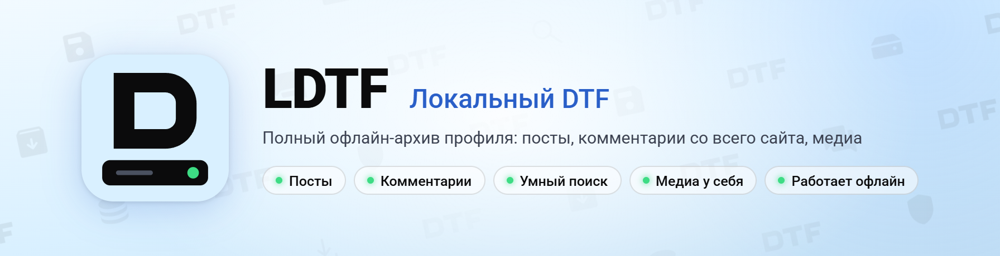

<picture>
  <source media="(prefers-color-scheme: dark)" srcset=".github/assets/banner-dark.png">
  
</picture>

# LDTF

<p>
  <a href="https://github.com/Gwynerva/ldtf/releases/latest"></a>
  <a href="LICENSE"></a>
</p>

**Локальный DTF.** Полный офлайн-архив профиля: посты, комментарии со всего сайта с контекстом, медиа.\
Смотрите в браузере, ищите, храните у себя — даже если сайт недоступен.

## Возможности

- **Полные посты:** все блоки редактора, галереи, видео, спойлеры, реакции и донаты. Каталог «Блоки DTF» показывает,
  как выглядит каждый блок, и находит в архивах посты с блоками, которые LDTF показывает упрощённо.
- **Комментарии со всего сайта** с контекстом: ветки родителей и ответы, лента по месяцам, дерево обсуждений. Или
  архив «Только посты» — без комментариев вовсе; выбор при создании архива, потом его можно сменить и освободить место.
- **Медиа у себя:** общее хранилище с дедупликацией по содержимому — одинаковые гифки не качаются дважды. Можно качать
  только медиа постов, а картинки из комментариев оставить на DTF; чего нет в архиве и не грузится с DTF, показывается
  аккуратной заглушкой.
- **Умный поиск:** формы слов, опечатки, неверная раскладка, фразы, исключения.
- **Несколько архивов:** переключение как между аккаунтами.
- **Живёт в трее или на сервере:** `LDTF.exe` с расписанием, автозапуском и уведомлениями только о важном — или Docker
  с паролем на веб-интерфейс. Обновляется прямо из настроек.
- **История версий:** правки постов и комментариев сохраняются — с подсветкой, что поменялось. Если пост или
  комментарий удалили, заморозили аккаунт или DTF подсунул заглушку, в архиве остаётся прежняя версия с пометкой.
  Удаление аккаунта или массовые потери останавливают синхронизацию до вашего решения.
- **Бережно к DTF:** один общий лимит запросов на все синхронизации. Паузы и докачка с места после любого сбоя.
- **Для ИИ-агентов и скриптов:** сервер MCP (поиск, посты, ветки комментариев, история, статистика — только чтение),
  `data/*.jsonl`, Markdown в `md/`, SQLite-база `view.sqlite`, консольная команда `dtf-backup`.

## Быстрый старт

**Windows**

1. Скачайте `LDTF-…-windows-x64.zip` из [последнего релиза](https://github.com/Gwynerva/ldtf/releases/latest) и распакуйте.
2. Запустите `LDTF.exe`: откроется браузер, значок появится в трее. Если Windows предупредит о неизвестном издателе —
   «Подробнее → Выполнить в любом случае».
3. Введите ник, id или ссылку на профиль DTF и нажмите «Создать архив».

**Сервер, NAS, Linux, macOS — Docker**

```sh
curl -O https://raw.githubusercontent.com/Gwynerva/ldtf/main/compose.yaml
echo LDTF_PASSWORD=придумайте-пароль > .env
docker compose up -d            # http://<адрес>:8765; обновление: docker compose pull && docker compose up -d
```

**ИИ-агенты:** «Настройки приложения → ИИ-агенты» — готовые команды для Claude Code, Claude Desktop, Cursor.

**Требования:** Windows 10/11 — ничего ставить не нужно, Python лежит в `runtime/`. Docker — образ для amd64 и arm64.
Из клона репозитория — Python 3.12+ без сторонних пакетов (`LDTF.cmd` или `./ldtf.sh`). Используется только публичное
API DTF, вход не нужен.

## Документация

- [Подробное руководство](docs/GUIDE.md): интерфейс, история версий, донаты, Docker, MCP, обновления, форматы данных,
  поиск, консоль, устройство.
- [Что нового](CHANGELOG.md) в каждой версии.
- [Как устроено API DTF](docs/DTF_API.md): эндпоинты, пагинация, CDN — для тех, кто будет адаптировать инструмент.

---

<sub>Лицензия [MIT](LICENSE). Неофициальный проект, не связан с DTF. Иконки интерфейса — [Material Symbols](https://github.com/google/material-design-icons)
(Apache License 2.0), просмотр изображений — [PhotoSwipe](https://photoswipe.com) (MIT).</sub>
